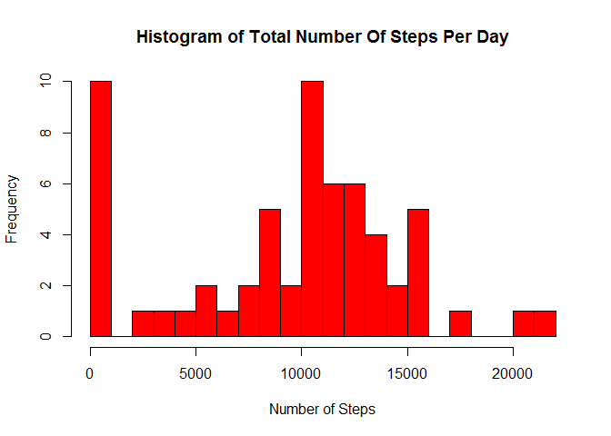

# Reproducible Research: Peer Assessment 1


## Loading and preprocessing the data

We read the raw data into a data table named dtActivity and update the data types for each column.


```r
library(data.table)
dtActivity <- fread(input = "activity.csv", sep = ",", colClasses = "character",
							stringsAsFactors = FALSE)

dtActivity$steps <- as.numeric(dtActivity$steps)
dtActivity$date <- as.Date(dtActivity$date, "%Y-%m-%d")
dtActivity$interval <- as.numeric(dtActivity$interval)
```


## What is the mean total number of steps taken per day?
  
We summarize the total steps by date into a new data table named dtStepsByDate


```r
dtStepsByDate <- dtActivity[, sum(steps, na.rm = TRUE), by = date]
setnames(dtStepsByDate, "V1", "totalSteps")
dtStepsByDate
```

```
##           date totalSteps
##  1: 2012-10-01          0
##  2: 2012-10-02        126
##  3: 2012-10-03      11352
##  4: 2012-10-04      12116
##  5: 2012-10-05      13294
##  6: 2012-10-06      15420
##  7: 2012-10-07      11015
##  8: 2012-10-08          0
##  9: 2012-10-09      12811
## 10: 2012-10-10       9900
## 11: 2012-10-11      10304
## 12: 2012-10-12      17382
## 13: 2012-10-13      12426
## 14: 2012-10-14      15098
## 15: 2012-10-15      10139
## 16: 2012-10-16      15084
## 17: 2012-10-17      13452
## 18: 2012-10-18      10056
## 19: 2012-10-19      11829
## 20: 2012-10-20      10395
## 21: 2012-10-21       8821
## 22: 2012-10-22      13460
## 23: 2012-10-23       8918
## 24: 2012-10-24       8355
## 25: 2012-10-25       2492
## 26: 2012-10-26       6778
## 27: 2012-10-27      10119
## 28: 2012-10-28      11458
## 29: 2012-10-29       5018
## 30: 2012-10-30       9819
## 31: 2012-10-31      15414
## 32: 2012-11-01          0
## 33: 2012-11-02      10600
## 34: 2012-11-03      10571
## 35: 2012-11-04          0
## 36: 2012-11-05      10439
## 37: 2012-11-06       8334
## 38: 2012-11-07      12883
## 39: 2012-11-08       3219
## 40: 2012-11-09          0
## 41: 2012-11-10          0
## 42: 2012-11-11      12608
## 43: 2012-11-12      10765
## 44: 2012-11-13       7336
## 45: 2012-11-14          0
## 46: 2012-11-15         41
## 47: 2012-11-16       5441
## 48: 2012-11-17      14339
## 49: 2012-11-18      15110
## 50: 2012-11-19       8841
## 51: 2012-11-20       4472
## 52: 2012-11-21      12787
## 53: 2012-11-22      20427
## 54: 2012-11-23      21194
## 55: 2012-11-24      14478
## 56: 2012-11-25      11834
## 57: 2012-11-26      11162
## 58: 2012-11-27      13646
## 59: 2012-11-28      10183
## 60: 2012-11-29       7047
## 61: 2012-11-30          0
##           date totalSteps
```


The total steps by date data presented as a histogram:


```r
hist(x = dtStepsByDate$totalSteps,
		col = "red",
		breaks = 20,
		main = "Histogram of Total Number Of Steps Per Day",
		xlab = "Number of Steps",
		ylab = "Frequency")
```

 


```r
meanSteps <- mean(dtStepsByDate$totalSteps, na.rm = TRUE)
medianSteps <- median(dtStepsByDate$totalSteps, na.rm = TRUE)
```

The mean number of steps is 9354.2295082.
The median number of steps is 1.0395\times 10^{4}.


## What is the average daily activity pattern?

We summarize the mean steps by interval into a new data table named dtStepsByInterval.


```r
dtStepsByInterval <- dtActivity[, mean(steps, na.rm = TRUE), by = interval]
setnames(dtStepsByInterval, "V1", "meanSteps")
dtStepsByInterval
```

```
##      interval meanSteps
##   1:        0 1.7169811
##   2:        5 0.3396226
##   3:       10 0.1320755
##   4:       15 0.1509434
##   5:       20 0.0754717
##  ---                   
## 284:     2335 4.6981132
## 285:     2340 3.3018868
## 286:     2345 0.6415094
## 287:     2350 0.2264151
## 288:     2355 1.0754717
```


The mean steps by interval data presented as a time-series plot:


```r
yRange <- c(0, 20 * (floor(max(dtStepsByInterval$meanSteps) / 20) + 1))
plot(dtStepsByInterval,
		type = "l",
		col = "black",
		ylim = yRange,
		main = "Mean Number Of Steps By Interval",
		xlab = "Interval",
		ylab = "Mean Number of Steps")
```

 


```r
dtOrdered <- dtStepsByInterval[order(-dtStepsByInterval$meanSteps, dtStepsByInterval$interval)]
maxInterval <- as.vector(dtOrdered[[1, "interval"]])
```

The interval with the largest mean number of steps is 835.


## Inputing missing values


```r
dtMissingValues <- dtActivity[is.na(dtActivity$steps)]
missingValues = nrow(dtMissingValues)
```

The number of rows with missing values is 2304.

We created a new data table called dtEstimatedActivity and populated the missing values with the  
mean values for the associated interval across the rest of the data set.  Any values still  
missing after this step were replaced with zeroes.


```r
dtEstimatedActivity <- dtActivity
dtEstimatedActivity$steps[is.na(dtEstimatedActivity$steps)] <- dtStepsByInterval[interval == dtEstimatedActivity$interval[is.na(dtEstimatedActivity$steps)]]$meanSteps
dtEstimatedActivity$steps[is.na(dtEstimatedActivity$steps)] <- 0
```


The total steps by date for the new estimated data presented as a histogram:


```r
dtEstimatedStepsByDate <- dtEstimatedActivity[, sum(steps, na.rm = TRUE), by = date]
setnames(dtEstimatedStepsByDate, "V1", "totalEstimatedSteps")

yRange <- c(0, 1000 * (floor(max(dtEstimatedStepsByDate$totalEstimatedSteps) / 1000) + 1))
hist(x = rep(dtEstimatedStepsByDate$date, dtEstimatedStepsByDate$totalEstimatedSteps),
		breaks = "days",
		freq = TRUE,
		col = "red",
		ylim = yRange,
		main = "Total Number Of Steps By Date (Missing Values Estimated)",
		xlab = "Date",
		ylab = "Number of Steps")
```

 


```r
meanEstimatedSteps <- mean(dtEstimatedStepsByDate$totalEstimatedSteps, na.rm = TRUE)
medianEstimatedSteps <- median(dtEstimatedStepsByDate$totalEstimatedSteps, na.rm = TRUE)
```

The mean number of steps with the missing values estimated is 1.0766189\times 10^{4} compared to 9354.2295082 before estimating the missing data.
The median number of steps with the missing values estimated is 1.0766189\times 10^{4} compared to 1.0395\times 10^{4} before estimating the missing data.


## Are there differences in activity patterns between weekdays and weekends?

We summarize the mean steps by type of day and interval into a new data table
named dtStepsByTypeOfDayAndInterval.


```r
dtActivity <- cbind(dtActivity, data.table("DayOfWeek" = weekdays(dtActivity$date)))
dtActivity <- cbind(dtActivity, data.table("TypeOfDay" = character(nrow(dtActivity))))

for (row in 1:nrow(dtActivity))
{
	dtActivity[row]$TypeOfDay <- switch(dtActivity[row]$DayOfWeek,
										Monday = "Weekday",
										Tuesday = "Weekday",
										Wednesday = "Weekday",
										Thursday = "Weekday",
										Friday = "Weekday",
										Saturday = "Weekend",
										Sunday = "Weekend")
}

dtStepsByTypeOfDayAndInterval <- dtActivity[, mean(steps, na.rm = TRUE), by = c("TypeOfDay", "interval")]
setnames(dtStepsByTypeOfDayAndInterval, "V1", "meanSteps")
```


The mean steps by interval data presented as a time-series plot:


```r
library(lattice)
xyplot(meanSteps ~ interval | TypeOfDay,
		data = dtStepsByTypeOfDayAndInterval,
		type = "l",
		main = "Mean Number Of Steps By Type Of Day And Interval",
		xlab = "Interval",
		ylab = "Mean Number of Steps",
		layout = c(2, 1))
```

 
